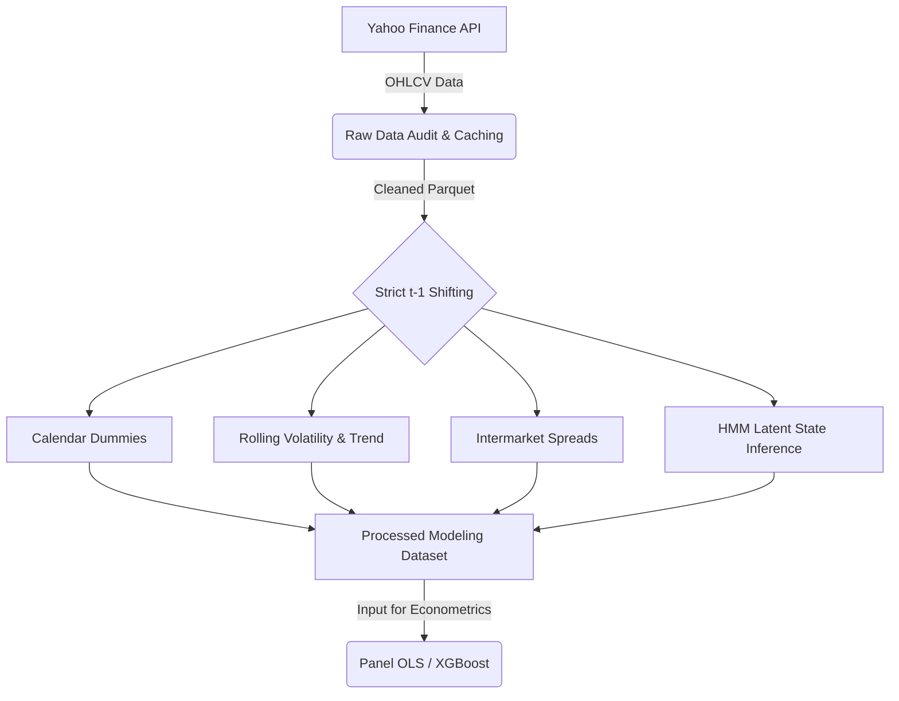

# Data Engineering Pipeline

This document outlines the data acquisition and feature engineering processes used in this research. The objective of the data pipeline is to construct a rigorous, lookahead-safe dataset for analyzing conditional anomalies in the Indian power sector.

## Data Acquisition

The primary data source for this project is public End-of-Day (EOD) OHLCV (Open, High, Low, Close, Volume) data. 

*   **Source:** Yahoo Finance API (`yfinance`).
*   **Universe:** 14 major Indian power-sector equities (e.g., NTPC, TATAPOWER, POWERGRID, NHPC) and major indices (Nifty 50, Bank Nifty, Nifty Energy).
*   **Timeframe:** Historical data spans from each asset's listing date (some beginning as early as January 2005) up to July 2026. 
*   **Storage:** Raw data is downloaded in bulk, audited for missing values, corporate actions (splits/dividends), and extreme outliers, and then cached locally as Parquet files.

## Feature Engineering and Leakage Prevention

The core constraint of the feature engineering pipeline is strict $t-1$ safety. To ensure that statistical models do not inadvertently train on future information (lookahead bias), every feature used to explain the return on day $t$ is calculated using only information available at the close of day $t-1$.

### Engineered Feature Families

1.  **Calendar Features:** One-hot encoded variables representing the day of the week.
2.  **Volatility & Trend:** Rolling standard deviations and moving averages over various lookback windows (e.g., 5-day, 20-day) to capture short-term and medium-term momentum.
3.  **Intermarket Spreads:** Relative strength indicators comparing the performance of the power sector (using Nifty Energy as a proxy) against other sectors, designed to observe sector rotation.
4.  **HMM Regimes:** A Gaussian Hidden Markov Model (`hmmlearn`) trained on historical returns to infer latent, unobservable market states (e.g., "High Volatility" vs. "Low Volatility"). The regime classification is computed on a rolling basis to prevent forward-looking data leakage.

## Pipeline Architecture Diagram

