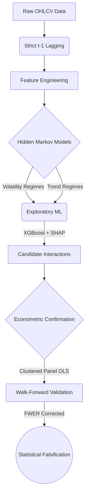

# Quantitative Research: The "Weekday Effect" in Indian Power Equities

This repository contains a quantitative research pipeline designed to investigate conditional calendar anomalies (specifically the "Weekday Effect") within the Indian power sector. 

The primary objective was to determine whether daily stock returns exhibit predictable bias based on the day of the week, and whether that bias is influenced by latent market states (volatility, trend, sector rotation).

## Scientific Verdict: Falsified
After a rigorous statistical audit, the hypothesis was falsified. The analysis indicates that the Indian power sector is efficient at the daily frequency; historical profitability observed in backtests of the weekday anomaly appears to be driven by random clustering and data-mining rather than structural market inefficiency. 

The research program was halted at Phase 2 due to the identification of an overfit, non-generalizable hypothesis. We exhausted the low-frequency feature space (Price, Volume, HMM Regimes, Intermarket Spreads) and identified that further analysis would require institutional flow data (FII/DII stock-specific tick data), which is unavailable publicly.

## Pipeline Architecture
This repository implements a framework for hypothesis testing, designed to mitigate common quantitative research pitfalls such as lookahead bias, p-hacking, and overfitting.

Key architectural features include:
*   **Strict $t-1$ Leakage Prevention:** Every feature is aggressively lagged to ensure models only predict tomorrow's return using today's closing state.
*   **Dynamic Market Regimes (HMM):** Integrates `hmmlearn` to map non-stationary macroeconomic volatility and trend states without lookahead bias.
*   **Exploratory Machine Learning (XGBoost + SHAP):** Uses constrained tree-based models and SHAP value extraction to search for non-linear interactions between market states and calendar days.
*   **Clustered Panel Econometrics:** Uses `linearmodels` (Fixed Effects, Clustered Standard Errors) to estimate true causal effects while controlling for market beta (Nifty 50).
*   **Statistical Discipline:** Implements Bonferroni Family-Wise Error Rate (FWER) corrections and Seasonal-Aware Walk-Forward Out-Of-Sample (OOS) validation.

## Repository Structure
*   `src/doweffect/`: Core modules.
    *   `features/`: HMM regime mapping, event proximity, returns, and intermarket spread construction.
    *   `ml/`: Exploratory XGBoost discovery and SHAP interaction extraction.
    *   `stats/`: Econometric confirmation testing (Panel OLS) and Walk-Forward OOS splitting.
*   `scripts/`: Execution runners (e.g., `run_hmm_discovery.py`, `run_spreads_discovery.py`).
*   `data/`: Data storage (raw and processed Parquet files are git-ignored; see `data/audit/audit_report.csv` for the dataset timeline spanning 2005-2026).
*   `tests/`: `pytest` suite for integrity and leakage checks.

## Setup and Execution
1.  Initialize a virtual environment: `python -m venv venv`
2.  Activate the environment and install requirements: `pip install -r requirements.txt` (Note: ensure you have `linearmodels`, `hmmlearn`, `xgboost`, `shap`, `pandas`, `yfinance`, and `pytest` installed).
3.  To run the full HMM-based discovery pipeline on the universe: `python scripts/run_hmm_discovery.py`

*Note: The `Docs/` directory is an external user-specific folder and is ignored by Git.*
