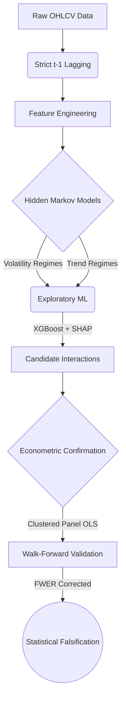

# The "Weekday Effect" in Indian Power Equities

This repository investigates conditional calendar anomalies (specifically the "Weekday Effect") within the Indian power sector. 

The primary objective was to determine whether daily stock returns exhibit predictable bias based on the day of the week, and whether that bias is influenced by latent market states (volatility, trend, sector rotation).

## Scientific Verdict: No Robust Weekday Alpha

**Within the feature families, assets, timeframe, and statistical framework investigated, we found no reproducible conditional alpha related to the day of the week.**

Despite progressively increasing model complexity—from unconditional weekday tests through conditional regimes, HMM state inference, and intermarket spread features—we found no evidence of economically meaningful, out-of-sample stable weekday-related alpha in Indian power-sector equities using publicly available daily data. This suggests that any exploitable inefficiency, if present, either exists outside the examined feature space, at a different temporal resolution, or requires information unavailable in public daily datasets.

## Statistical Results & Metrics Explained

### 1. Adjusted P-Values (FWER / Bonferroni)
During the conditional phases, the primary metric for statistical significance was the **Adjusted P-Value**. To prevent p-hacking across hundreds of combinations, we applied the Family-Wise Error Rate (FWER) via the Bonferroni Correction.
* **Key Finding:** Most stocks hit exactly `p = 1.000` (100% probability of random noise). Even when the pooled universe passed FWER in-sample (`p = 0.0463`), it immediately failed out-of-sample.

### 2. SHAP Scores (Feature Importance)
During the Machine Learning discovery phase, candidate interactions were ranked by their **SHAP Scores**.
* **Key Finding:** In Phase 2.3, the top intermarket spread interaction scored `0.000015`. A SHAP score this astronomically low indicates the ML engine was completely starved of signal and forced to model random noise.

### 3. Walk-Forward Coefficient Stability (t-stats)
In the final verification, we measured the **OOS t-statistic** of the anomaly across three different out-of-sample time windows.
* **Key Finding:** The anomaly produced a t-stat of `6.595` in 2015-2016, flipped to `-1.834` in 2017-2018, and decayed to `0.349` in 2019-2020. This 33% sign flip rate is the definition of **Regime Decay**. The anomaly is structurally unstable.

### 4. Predictive OOS Metrics
To prove the anomaly was untradeable, we locked the training coefficients and used them to predict unseen future data.
* **Key Finding:** The Out-of-Sample $R^2$ was strictly negative (e.g., `-0.0079`). A negative OOS $R^2$ is mathematical proof that the model is literally worse at predicting returns than just guessing the historical average. RMSE and MAE hovered around 78-97 basis points, completely overwhelming any theoretical daily signal.

## Project Termination: A Methodological Success

The decision was made to halt the research program after exhausting available daily price and volume features. This was a deliberate choice to preserve scientific integrity. 

When high-quality institutional flow data was deemed unavailable, the project faced a methodological crossroads: either invent derived proxies from existing low-frequency data, or terminate the search. 

Choosing to invent proxies from data already proven to lack predictive power introduces severe data mining risks. Instead, the project was concluded upon reaching a predefined stopping criterion. Maintaining strict methodological standards—such as avoiding proxy mining, retaining strict out-of-sample validation, and applying stringent multiple-testing corrections—ensures that the finding of "no robust edge" remains a highly valuable, scientifically defensible result. This discipline successfully prevents capital deployment into overfit, non-generalizable hypotheses.

## The True Asset: The Research Engine

The most important outcome of this project was not the anomaly itself, but the creation of a rigorous testing **engine**. This repository serves as a reusable framework designed to mitigate common research pitfalls.

Key architectural features built into the engine include:
*   **Leakage-Safe Pipeline:** Strict $t-1$ lagging to ensure models only predict tomorrow's return using today's closing state.
*   **Dynamic Market Regimes (HMM):** Integrates `hmmlearn` to map non-stationary macroeconomic states without lookahead bias.
*   **Exploratory Discovery Layer:** Uses constrained XGBoost models and SHAP value extraction to search for non-linear interactions.
*   **Panel Econometrics:** Uses `linearmodels` (Fixed Effects, Clustered Standard Errors) to estimate true causal effects while controlling for market beta.
*   **Statistical Discipline:** Implements Bonferroni Family-Wise Error Rate (FWER) corrections and Walk-Forward Out-Of-Sample validation.
*   **Reproducible Workflow:** Strict research governance, experiment registries, and hypothesis ledgers.

## Repository Structure
*   `Documents/FINAL_METHODOLOGY_AND_VERIFICATION.md`: The permanent methodological reference and verification audit for the project.
*   `Documents/DATA_PIPELINE.md`: A detailed explanation of the data acquisition (Yahoo Finance), timeframe (2005-2026), and strict $t-1$ feature engineering process (HMM regimes, volatility, intermarket spreads).
*   `src/doweffect/`: Core modules.
    *   `features/`: HMM regime mapping, event proximity, returns, and intermarket spread construction.
    *   `ml/`: Exploratory XGBoost discovery and SHAP interaction extraction.
    *   `stats/`: Econometric confirmation testing (Panel OLS) and Walk-Forward OOS splitting.
*   `scripts/`: Execution runners (e.g., `run_hmm_discovery.py`, `run_spreads_discovery.py`).
*   `data/`: Data storage (raw and processed Parquet files are git-ignored; see `data/audit/audit_report.csv` for the dataset timeline spanning 2005-2026).
*   `tests/`: `pytest` suite for integrity and leakage checks.

## Future Research Directions
Having exhausted unconditional weekday, volatility, trend, liquidity, HMM, and intermarket spread features on daily OHLCV data, future meaningful directions involve qualitatively different dimensions:
1. **Intraday Microstructure:** (1-minute, 5-minute, order-book data).
2. **Options & Volatility Risk Premia:** (Implied vs. realized volatility, Greeks, skew).
3. **Cross-Sectional Statistical Arbitrage:** (Cointegration, pairs trading, residual mean reversion).

## Setup and Execution
1.  Initialize a virtual environment: `python -m venv venv`
2.  Activate the environment and install requirements: `pip install -r requirements.txt`
3.  To run the full HMM-based discovery pipeline on the universe: `python scripts/run_hmm_discovery.py`
